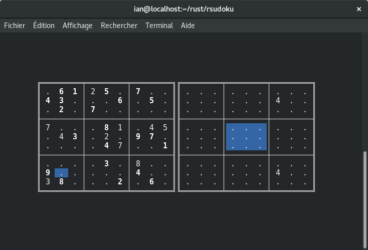

# RSudoku 

RSudoku is an all-in-one Sudoku solver, generator, and interactive
game, written in Rust.

## Usage 

For a description of basic usage from the command line, run `rsudoku
help`. The functionality of RSudoku is organized into subcommands,
such as `rsudoku generate`, which are described below. When RSudoku is
run without a subcommand, it launches the interactive <abbr
title="text user interface">TUI</abbr> game, as described in the
[relevant section](#tui).

### `generate` 

The `generate` subcommand is used for generating random Sudoku
grids. When run, it will output a Sudoku grid (which is guaranteed to
have a unique solution) as nine lines of nine digits each. When run
with the `-p` or `--pretty` option, the output will be pretty printed
(a grid will be drawn around the output).

### `print` 

The `print` subcommand simply reads the Sudoku file given as an
argument (or given via standard input if no file is provided, or if
the filename is `-`) and prints it back out again. As with the
[`generate`](#generate) subcommand, the `-p` or `--pretty` option can
be used for pretty printing. For the purposes of parsing the input,
whitespace and pipe (`|`) characters will be ignored, and the
characters `0`, `.`, and `_` will all be recognized as an empty
cell. Any characters besides these and the standard numbers 1-9 will
result in an error. In particular, the Sudoku output of RSudoku
(whether pretty printed or not) can be parsed by this subcommand.

This subcommand may not seem very useful, but it may be convenient for
visualizing poorly formatted Sudoku puzzles found elsewhere. It should
be noted that this subcommand will reject inconsistent Sudokus with an
error (that is, those Sudoku grids which violate one of the basic
rules, such as having two of the same number in a row; it does *not*
guarantee that the Sudoku has a solution).

### `solve` 

The `solve` subcommand will parse the given file (or standard input)
in the same way as the [`print`](#print) subcommand and output its
solution if one is found (pretty printing using `-p` or `--pretty` as
before). By default, only the first solution found will be output; to
output all solutions, use the `-a` or `--all` option, which will
separate each solution by a line filled with an appropriate number of
`=` characters.

## Interactive game (TUI) 

RSudoku comes with an interactive console-based game with vi-like
keybindings and several nice features (such as annotations). It can be
started by running RSudoku with no arguments.

There is an annotations display which can be toggled using the
`:annot` and `:noannot` commands (see [below](#tui-commands)). When it
is enabled, another grid will appear next to the main sudoku grid
which displays all the annotations for the currently selected 3x3
box. For example, if the in-game cursor is in the top-left cell, then
the annotations window will display the annotations for the top-left
3x3 box, containing the annotations for nine cells in total. Each
large square in the annotations window contains the annotations for a
single cell: if the annotation is enabled for a particular cell, it
will appear in the corresponding box in the annotations window. See
the screenshot [at the top of this document](#top) for an example of
how this looks.

### Controls 

To see these controls in-game, run the `:help` command.

* **hjkl** or **arrow keys**: movement by cell
* **HJKL**: movement by 3x3 box
* **1-9**: fill cell with number
* **0**, **d**, **x**, **DELETE**: clear number in cell
* **a** *<number>*: toggles annotation for *<number>* in cell
* **u**: undo last action
* **:**: input an ex-style command (see [list](#tui-commands) below)

### Commands 

Several commands can be used with the `:` key, just as with vi's
ex-style commands.

* **:q**: quit the game
* **:annot**: turn on annotations display
* **:noannot**: turn off annotations display
* **:help**: show in-game help
* **:hint**: give a hint
* **:new**: start a new game
* **:solve**: solve the current board

## License

RSudoku is free software, released under the GNU <abbr title="General
Public License">GPL</abbr>, version 3 (or any later version). A copy
of the license text can be found in the `LICENSE` file at the root of
the project repository, or on the [GNU project
website](http://www.gnu.org/licenses/).
